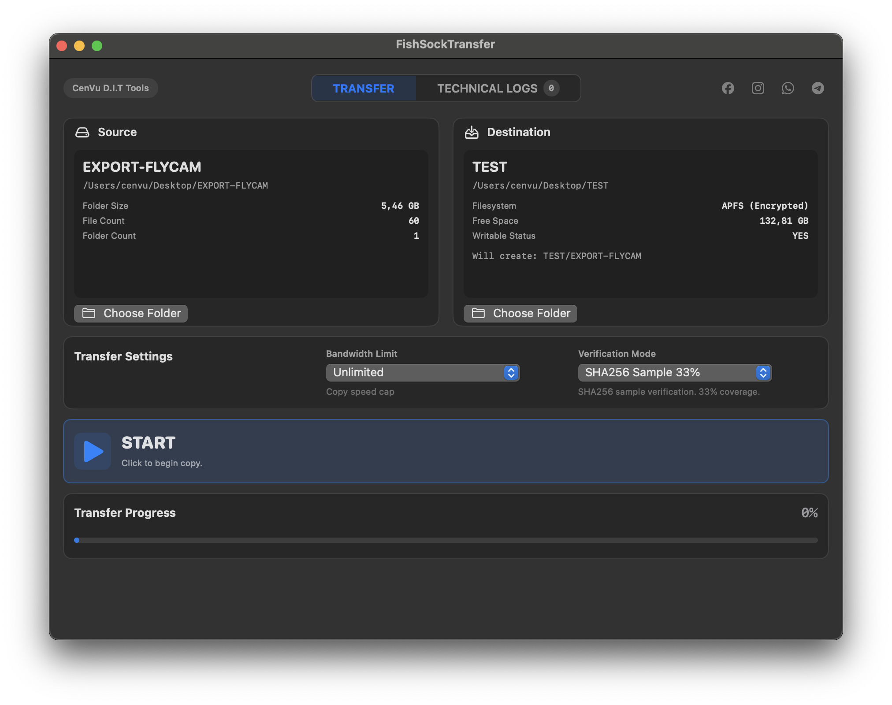
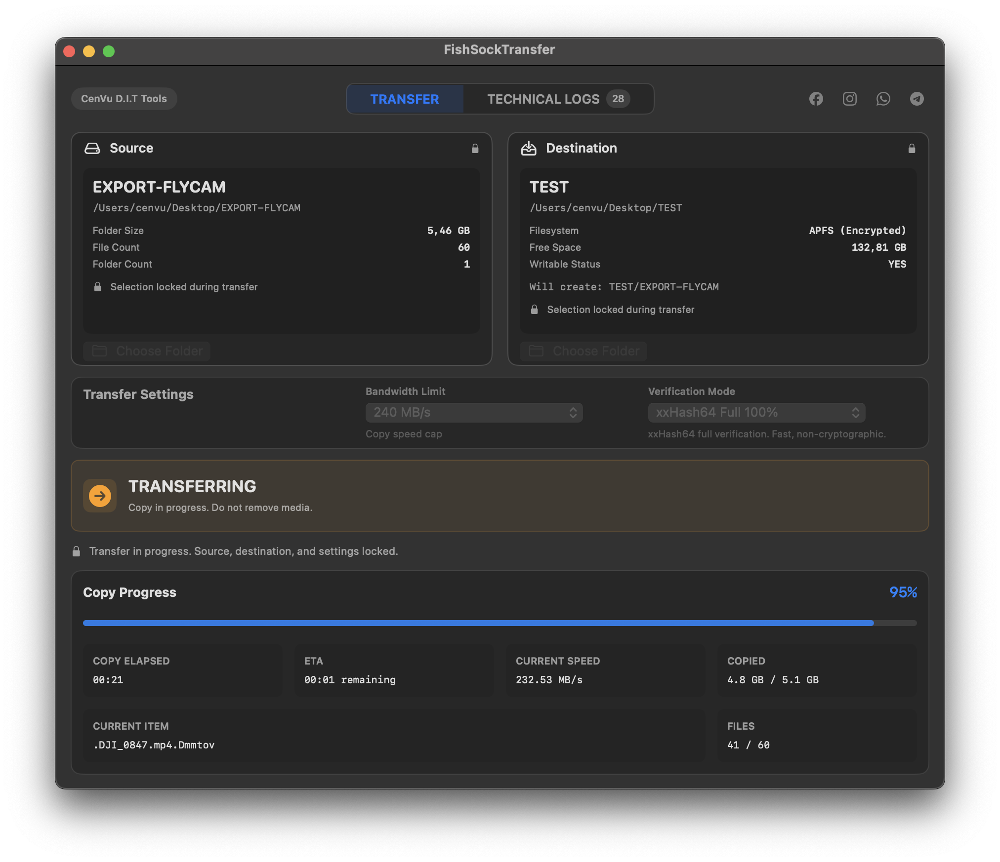
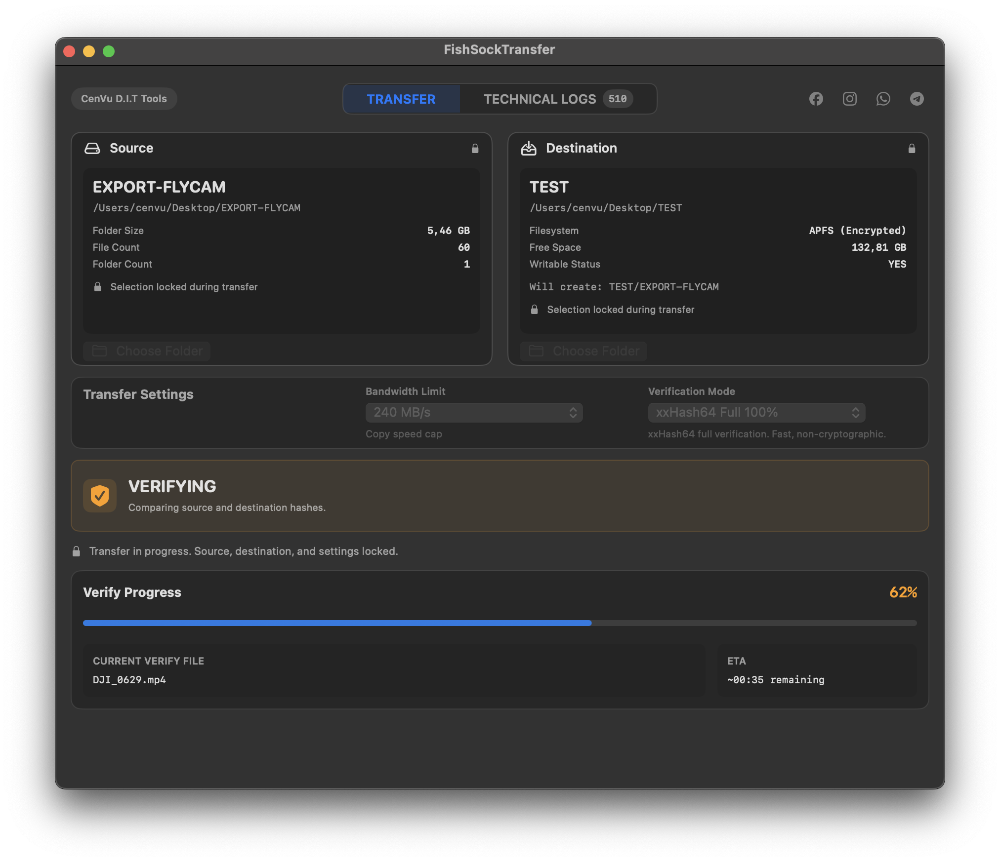
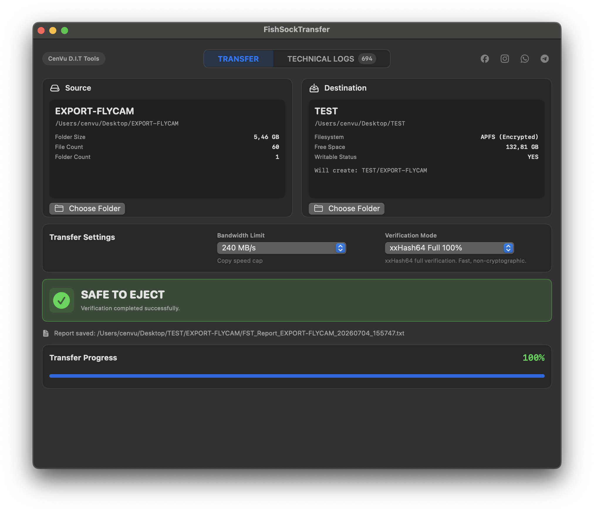
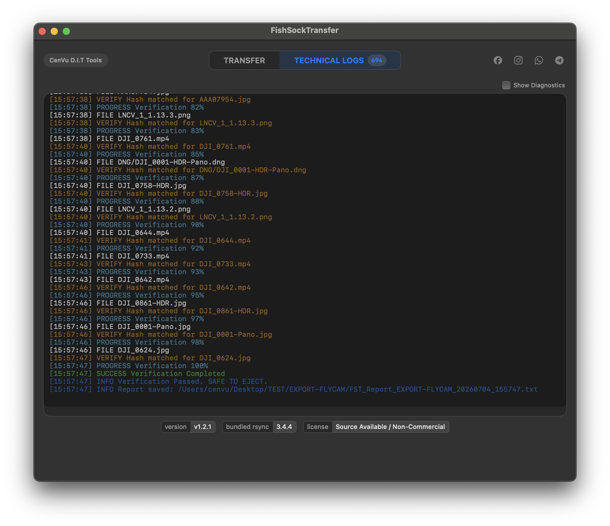

<!-- FST / CenVu | (+84) 842 841 222 -->

# FST — FishSock Transfer

FST is a native macOS copy/verify/report tool for DIT and Data Wrangler workflows.

FST là công cụ native macOS hỗ trợ copy/verify/report cho workflow DIT và Data Wrangler.

**Core workflow / Quy trình chính:** `COPY → VERIFY → SAFE TO EJECT → REPORT`

---

## What FST is / FST là gì

This is not just a copy app. It is a tool built for operators who need clear evidence before deciding whether media is safe to eject or hand over — copying, verifying, and reporting on transfers so the decision stays informed instead of assumed.

Đây không chỉ là một app copy đơn thuần. FST được xây dựng cho những người vận hành cần bằng chứng rõ ràng trước khi quyết định media có an toàn để rút ra hay bàn giao hay không — copy, verify, và report cho từng lần transfer để quyết định luôn dựa trên dữ liệu thật, không phải phỏng đoán.

FST does not format cards or drives, does not erase source media, and does not make the final production decision for you. It gives you copy/verify status, logs, and a report — the decision stays with the operator.

FST không format thẻ hay ổ cứng, không xoá dữ liệu nguồn, và không thay bạn ra quyết định production cuối cùng. App cung cấp trạng thái copy/verify, log, và report — quyết định vẫn thuộc về người vận hành.

---

## Important safety notice / Miễn trừ trách nhiệm quan trọng

FST supports the copy/verify/report process, but it does not replace professional judgment, independent backups, or manual review.

FST hỗ trợ quy trình copy/verify/report, nhưng không thay thế phán đoán chuyên môn, backup độc lập, hoặc việc kiểm tra thủ công của người vận hành.

No software can guarantee absolute protection from data loss, corruption, hardware failure, operator error, filesystem issues, or unexpected system behavior. The software is provided "as is," without warranty of any kind, and to the maximum extent permitted by law the project owner and contributors are not liable for damages — including data loss, lost footage, or production delay — caused by user actions or misuse.

Không phần mềm nào có thể đảm bảo bảo vệ tuyệt đối khỏi mất dữ liệu, hỏng dữ liệu, lỗi phần cứng, lỗi thao tác, lỗi filesystem, hoặc hành vi hệ thống ngoài dự kiến. Phần mềm được cung cấp theo nguyên trạng "as is", không có bảo hành, và trong phạm vi pháp luật cho phép, chủ dự án và contributors không chịu trách nhiệm cho thiệt hại — bao gồm mất dữ liệu, mất footage, hoặc chậm trễ production — do thao tác hoặc sử dụng sai của người dùng.

`SAFE TO EJECT` means FST has completed the current copy/verification workflow according to the settings you selected. It is **not** automatic legal, operational, or production approval to erase, format, or reuse source media — that decision remains with the operator.

`SAFE TO EJECT` có nghĩa là FST đã hoàn tất workflow copy/verification hiện tại theo settings đã chọn. Đây **không phải** là phê duyệt pháp lý, vận hành, hay production để xoá, format, hoặc tái sử dụng source media — quyết định đó vẫn thuộc về người vận hành.

**Operators remain responsible for / Người vận hành vẫn chịu trách nhiệm cho:**

- selecting the correct source and destination / chọn đúng source và destination
- maintaining independent backups / duy trì backup độc lập
- reviewing reports, logs, and warnings before acting / kiểm tra report, log và warning trước khi hành động
- the final decision to format, erase, or reuse source media / quyết định cuối cùng về format, xoá, hoặc tái sử dụng source media

Recommended practice: keep at least two independent verified copies before formatting or reusing source media. For the full disclaimer, see [docs/legal/DISCLAIMER.md](docs/legal/DISCLAIMER.md).

Khuyến nghị: duy trì ít nhất hai bản copy độc lập đã verify trước khi format hoặc tái sử dụng source media. Để đọc bản miễn trừ trách nhiệm đầy đủ, xem [docs/legal/DISCLAIMER.md](docs/legal/DISCLAIMER.md).

---

## Workflow Preview / Xem trước workflow

The screenshots below show the intended operator flow: start, transfer, verification, safe-to-eject confirmation, and technical logs.

Các hình bên dưới minh hoạ luồng thao tác chính: bắt đầu, chuyển dữ liệu, xác minh, xác nhận an toàn để rút thiết bị, và log kỹ thuật.

### 1. Start / Bắt đầu

### 2. Transferring / Đang chuyển dữ liệu

### 3. Verifying / Đang xác minh

### 4. Safe To Eject / An toàn để rút thiết bị

### 5. Technical Logs / Log kỹ thuật

---

## What FST does / FST làm gì

- Copies from source to destination / Copy từ source sang destination
- Verifies according to the selected mode / Verify theo chế độ đã chọn
- Produces a report of the result / Tạo report cho kết quả
- Gives a clear final status / Hiển thị trạng thái cuối rõ ràng
- Supports — but doesn't replace — the operator's decision / Hỗ trợ, chứ không thay thế, quyết định của người vận hành

## What FST does not do / FST không làm gì

- Does not format source media / Không format source media
- Does not erase source media / Không xoá source media
- Does not replace DIT/Data Wrangler judgment / Không thay thế phán đoán của DIT/Data Wrangler
- Does not remove the need for independent backups / Không loại bỏ nhu cầu backup độc lập
- Does not guarantee protection from hardware, user, or filesystem failure / Không đảm bảo an toàn trước lỗi phần cứng, lỗi thao tác, hoặc lỗi filesystem
- Does not automatically approve media for reuse / Không tự động phê duyệt media để tái sử dụng

---

## Basic workflow / Cách sử dụng cơ bản

1. Select source / Chọn source
2. Select destination / Chọn destination
3. Choose verification mode / Chọn chế độ verification
4. Start transfer / Bắt đầu transfer
5. Monitor status and logs / Theo dõi status và log
6. Review the final report / Kiểm tra report cuối cùng
7. Only proceed once `SAFE TO EJECT` is shown and you've verified the workflow requirements / Chỉ tiếp tục khi `SAFE TO EJECT` hiển thị và bạn đã kiểm tra đủ yêu cầu workflow

Verification modes are `none` (no post-copy check), `random33` (roughly 33% of files verified via SHA256), and `full` (all files verified via xxHash64). `random33` is not equivalent to full verification — use `full` when maximum confidence is required.

Các chế độ verification gồm `none` (không kiểm tra sau copy), `random33` (verify ngẫu nhiên khoảng 33% file bằng SHA256), và `full` (verify toàn bộ file bằng xxHash64). `random33` không tương đương full verification — dùng `full` khi cần độ tin cậy cao nhất.

FST exports a text report after each transfer. Keep it with the copied media for later checking, handover, or production records.

FST xuất báo cáo dạng text sau mỗi lần transfer. Nên lưu report cùng dữ liệu đã copy để kiểm tra, bàn giao, hoặc lưu hồ sơ production.

---

## Current status / Trạng thái hiện tại

| | |
|---|---|
| **Version / Phiên bản** | v1.3.1 |
| **Last update / Cập nhật gần nhất** | July 2026 |
| **Platform / Nền tảng** | macOS 13.5+ |
| **Architecture / Kiến trúc** | Apple Silicon arm64 only |
| **Signing / Ký ứng dụng** | Ad-hoc signed |
| **Notarization** | Not notarized / chưa notarized |
| **Scope / Phạm vi** | MVP — single source, single destination, single active job |
| **Transfer engine** | Bundled rsync 3.4.4 |
| **Release focus** | Manual GitHub update check |

v1.3.1 adds a manual GitHub release update-check in the Technical Logs footer. The operator must click Check for Updates; FST only compares the installed version with the latest GitHub Release and opens release/download links in the browser. It does not auto-download, auto-install, mutate the app bundle, use Sparkle, or change copy, verify, report generation, transfer result, app state, Telegram, or SAFE TO EJECT semantics.

System requirements: macOS 13.5+, an Apple Silicon Mac, mounted source and destination storage, and enough free space on the destination. Intel Macs are not officially supported at this stage.

Yêu cầu hệ thống: macOS 13.5 trở lên, máy Mac Apple Silicon, ổ source và destination đã mount, và destination còn đủ dung lượng trống. Hiện tại Mac Intel chưa được hỗ trợ chính thức.

---

## Download and installation / Tải và cài đặt

Download the release `.zip` from GitHub Releases, extract it, and move `FishSockTransfer.app` to `Applications` or another trusted test location. Because current builds are ad-hoc signed and not notarized, macOS may warn on first launch — use **Right-click → Open**, or follow the Sentinel / Gatekeeper instructions in the release notes if provided.

Tải file `.zip` từ GitHub Releases, giải nén, và chuyển `FishSockTransfer.app` vào `Applications` hoặc vị trí test đáng tin cậy. Vì bản build hiện tại ad-hoc signed và chưa notarized, macOS có thể cảnh báo khi mở lần đầu — dùng **Right-click → Open**, hoặc làm theo hướng dẫn Sentinel / Gatekeeper trong release notes nếu có.

---

## Documentation / Tài liệu

This repository is public for review, learning, non-commercial use, and controlled development. FST is currently an MVP focused on one source, one destination, and one active transfer job.

Repo này được công khai để review, học hỏi, sử dụng phi thương mại, và phát triển có kiểm soát. FST hiện là MVP tập trung vào một source, một destination, và một transfer job đang chạy.

- Product and technical docs: [docs/README.md](docs/README.md)
- Legal, license, trademark, and disclaimer docs: [docs/legal/README.md](docs/legal/README.md)
- Release notes: [docs/releases/README.md](docs/releases/README.md)
- AI/agent workflow docs: [FST_AI/README.md](FST_AI/README.md)

---

## License, commercial use, and branding / Giấy phép, sử dụng thương mại và thương hiệu

FST is source-available for review, learning, and non-commercial use. It is not offered as OSI-approved open-source software.

FST là source-available để review, học hỏi, và sử dụng phi thương mại. Đây không phải phần mềm nguồn mở chuẩn OSI.

Commercial use, paid redistribution, resale, white-labeling, paid hosting, or use as a material part of a paid product or service requires prior written permission from the project owner.

Việc sử dụng thương mại, phân phối có thu phí, bán lại, white-labeling, paid hosting, hoặc dùng FST như một phần quan trọng của sản phẩm/dịch vụ có thu phí cần có sự cho phép bằng văn bản từ chủ dự án.

The FishSock name, FishSock Transfer name, FST branding, app logo, app icon, and visual identity are not licensed with the source code. Third-party components, including bundled rsync 3.4.4, remain under their own licenses.

Tên FishSock, FishSock Transfer, thương hiệu FST, logo app, icon app, và nhận diện hình ảnh không được cấp phép kèm theo source code. Các thành phần third-party, bao gồm bundled rsync 3.4.4, vẫn giữ nguyên giấy phép riêng của chúng.

See / Xem:

- [LICENSE](LICENSE)
- [docs/legal/COMMERCIAL_LICENSE.md](docs/legal/COMMERCIAL_LICENSE.md)
- [docs/legal/TRADEMARKS.md](docs/legal/TRADEMARKS.md)
- [NOTICE](NOTICE)
- [docs/legal/THIRD_PARTY_LICENSES.md](docs/legal/THIRD_PARTY_LICENSES.md)
- [docs/legal/CONTRIBUTOR_TERMS.md](docs/legal/CONTRIBUTOR_TERMS.md)
- [docs/legal/DISCLAIMER.md](docs/legal/DISCLAIMER.md)

---

## Credits / Ghi nhận đóng góp

**Vũ Huy Hùng / Cen** — project owner, product direction, and DIT workflow design.
**Vũ Huy Hùng / Cen** — chủ dự án, định hướng sản phẩm, và thiết kế workflow DIT.

**Hà Minh Quang** — logo and app icon contribution.
**Hà Minh Quang** — đóng góp thiết kế logo và icon ứng dụng.

---

*Built for operators who cannot afford ambiguous copy results.*

*Được xây dựng cho những người vận hành không thể chấp nhận kết quả copy mơ hồ.*
