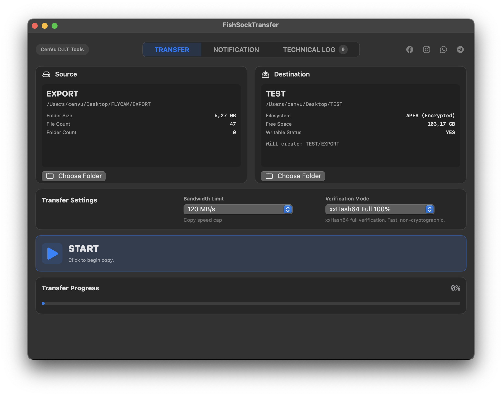
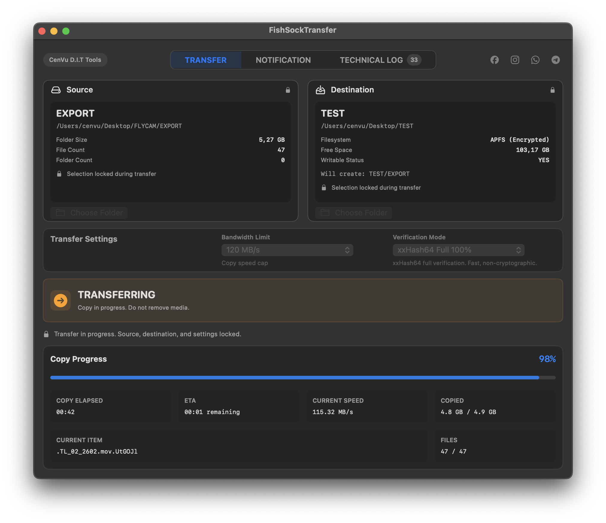
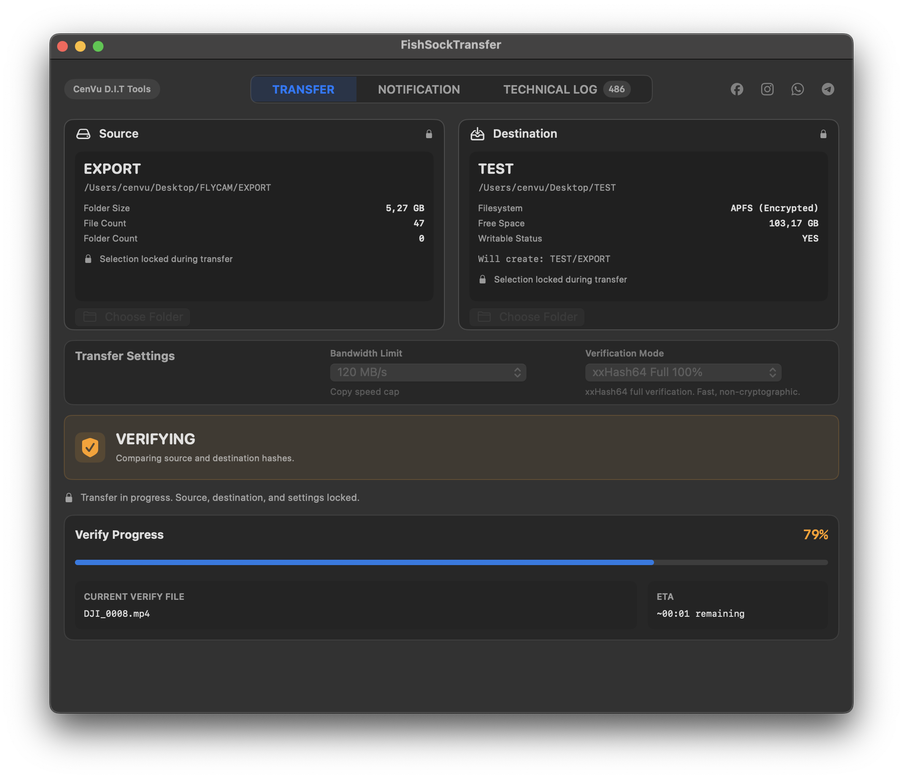
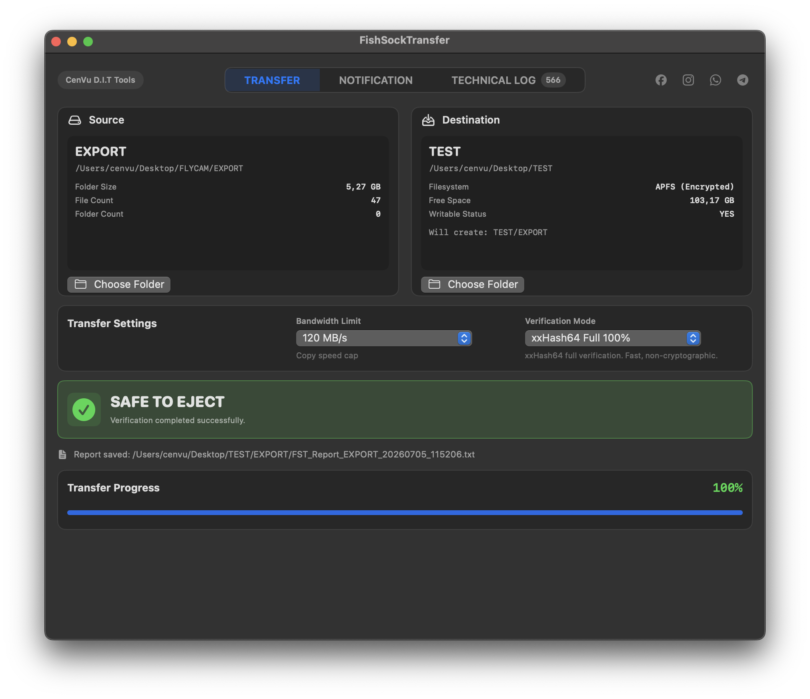
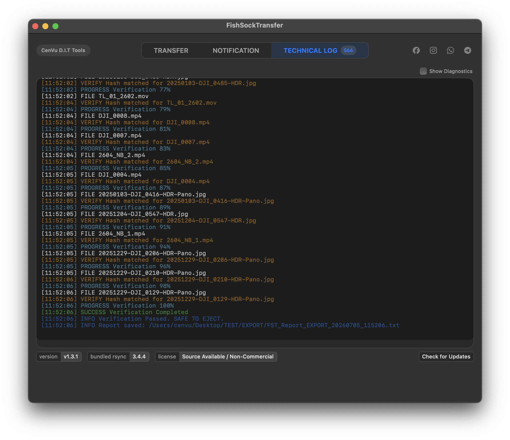
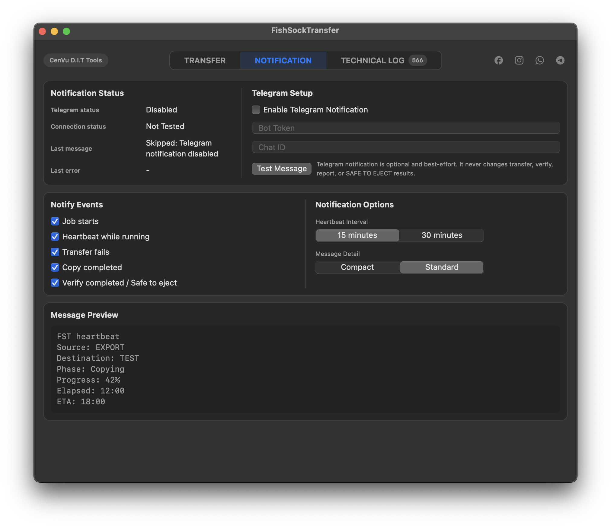

<!-- FST / CenVu | (+84) 842 841 222 -->

# FST — FishSock Transfer

English documentation is included below.

FST là công cụ copy/verify/report trên macOS dành cho workflow DIT và Data Wrangler.

FST is a macOS copy/verify/report tool for DIT and Data Wrangler workflows.

---

## Disclaimer / Miễn trừ trách nhiệm

FST là công cụ hỗ trợ copy/verify/report, không thay thế phán đoán chuyên môn, backup độc lập, hoặc kiểm tra thủ công.

Không phần mềm nào đảm bảo an toàn dữ liệu tuyệt đối trước mất dữ liệu, hỏng dữ liệu, lỗi phần cứng, lỗi thao tác, lỗi filesystem, hoặc hành vi hệ thống ngoài dự kiến.

Người dùng/người vận hành chịu trách nhiệm chọn đúng source, chọn đúng destination, kiểm tra dung lượng, chọn verification mode phù hợp, theo dõi warning/error, đọc report, duy trì backup độc lập.

Chủ dự án, contributor, và bên phân phối không chịu trách nhiệm với mất dữ liệu do thao tác người dùng hoặc dùng sai cách: chọn sai source/destination, ghi đè, xoá thủ công, format quá sớm, rút ổ không an toàn, bỏ qua failed copy/verify, bỏ qua warning/log/report, dùng phần cứng/ổ/cáp lỗi, force quit hoặc tắt máy khi transfer.

SAFE TO EJECT không phải phê duyệt tự động để format, xoá, hoặc tái sử dụng source media.

Phần mềm được cung cấp theo nguyên trạng “as is”, không có bảo hành.

Khuyến nghị: trước khi format hoặc tái sử dụng source media, nên có ít nhất hai bản copy độc lập đã được verify và đã kiểm tra report/destination data.

FST is a copy/verify/report support tool. It does not replace professional judgment, independent backups, or manual review.

No software can guarantee absolute protection from data loss, corruption, hardware failure, operator error, filesystem issues, or unexpected system behavior.

Users/operators are responsible for selecting the correct source and destination, checking available storage, choosing the appropriate verification mode, monitoring warnings/errors, reviewing reports, and maintaining independent backups.

The project owner, contributors, and distributors are not responsible for data loss caused by user actions or misuse, including wrong source/destination selection, overwriting data, manual deletion, early formatting, unsafe drive removal, ignored copy/verify failures, ignored warnings/logs/reports, unstable hardware/drives/cables, force quitting, or shutting down during transfer.

SAFE TO EJECT is not automatic approval to format, erase, or reuse source media.

The software is provided “as is”, without warranty of any kind.

Recommended practice: before formatting or reusing source media, maintain at least two independent verified copies and review the FST report and destination data.

[docs/legal/DISCLAIMER.md](docs/legal/DISCLAIMER.md)

---

## FST là gì? / What is FST?

FST có thể làm gì:
- chọn một source và một destination
- copy dữ liệu từ source sang destination
- verify theo mode đã chọn
- hiển thị trạng thái tiến trình và log
- tạo/report kết quả cuối
- giúp operator có bằng chứng rõ ràng trước khi quyết định rút hoặc bàn giao source media
- hỗ trợ Telegram notification
- dùng bundled rsync 3.4.4 cho transfer engine

What FST can currently do:
- select a single source and single destination
- copy data from source to destination
- verify using the selected mode
- display progress status and logs
- generate a final result report
- provide operators with clear evidence before deciding to eject or hand over source media
- support Telegram notifications
- use bundled rsync 3.4.4 for the transfer engine

FST không làm gì:
- không format source media
- không xoá source media
- không tự động eject ổ
- không thay thế quyết định của DIT/Data Wrangler
- không loại bỏ nhu cầu backup độc lập
- không đảm bảo an toàn tuyệt đối trước lỗi phần cứng, lỗi người dùng, lỗi filesystem, hoặc lỗi hệ thống
- phạm vi hiện tại: single source, single destination, single active job
- chưa phải công cụ multi-destination, queue, LTO, MHL, proxy, DAM, hay MAM

What FST cannot / does not do:
- does not format source media
- does not erase source media
- does not automatically eject drives
- does not replace the DIT/Data Wrangler's decision
- does not remove the need for independent backups
- does not guarantee absolute safety against hardware, user, filesystem, or system errors
- current MVP scope: single source, single destination, single active job
- is not a multi-destination, queue, LTO, MHL, proxy, DAM, or MAM tool

---

## Xem trước giao diện workflow / UI Workflow Preview

### 1. Bắt đầu / Start

### 2. Đang chuyển dữ liệu / Transferring

### 3. Đang xác minh / Verifying

### 4. An toàn để rút thiết bị / Safe To Eject

### 5. Log kỹ thuật / Technical Log

### 6. Thông báo Telegram / Telegram Notification

---

## Thông tin sử dụng và phát triển

### Trạng thái hiện tại
- Phiên bản: v1.3.3
- Nền tảng: macOS 13.5+, Apple Silicon arm64
- Chữ ký: ad-hoc signed
- Notarization: không được notarized
- Phạm vi: một nguồn, một đích, một tác vụ chạy tại một thời điểm
- Transfer engine: sử dụng rsync 3.4.4 đi kèm

v1.3.3 sửa lỗi quyền mạng outbound của bản build release/packaged bằng cách giữ lại entitlement network client của sandbox. Điều này cho phép quy trình check update GitHub thủ công và thông báo Telegram dùng HTTPS outbound như thiết kế. Bản release không thêm tính năng tự động tải, tự động cài đặt, Sparkle, sửa đổi app bundle, hay bất kỳ thay đổi logic nào về transfer/verify/rsync/report/SAFE TO EJECT/Telegram.

### Cài đặt cơ bản
- Tải file release zip từ GitHub Releases.
- Di chuyển ứng dụng vào thư mục Applications.
- Do ứng dụng chưa được notarized, macOS có thể hiện cảnh báo.
- Sử dụng Chuột phải (Right-click) -> Open để mở ứng dụng.

### Workflow sử dụng cơ bản
- Mở ứng dụng FST.
- Chọn thư mục nguồn.
- Chọn thư mục đích.
- Chọn chế độ xác minh: none, random33, hoặc full.
- Bắt đầu sao chép.
- Theo dõi tiến trình và nhật ký.
- Kiểm tra báo cáo cuối cùng.
- Chỉ tiếp tục xử lý thẻ/ổ cứng nguồn khi có thông báo SAFE TO EJECT và bạn đã xác nhận lại yêu cầu workflow.

### Telegram Notification
Nếu bạn muốn dùng tính năng gửi thông báo qua Telegram, xem hướng dẫn:
[Hướng dẫn tạo Telegram Bot cho FST](docs/guides/telegram-bot-setup.md)

### Tài liệu kỹ thuật và phát triển
Tài liệu chi tiết về kiến trúc và quy định phát triển được lưu tại thư mục `docs`, không đặt tại README.
Xem chi tiết tại:
- [docs/README.md](docs/README.md)
- [docs/releases/README.md](docs/releases/README.md)
- [FST_AI/README.md](FST_AI/README.md)
- [AGENTS.md](AGENTS.md)

### Giấy phép, thương mại, thương hiệu
- FST công khai mã nguồn để kiểm tra, học tập, và sử dụng phi thương mại.
- Đây không phải phần mềm open-source chuẩn OSI.
- Mọi hoạt động sử dụng thương mại cần có sự cho phép bằng văn bản từ dự án.
- Tên FishSock, FishSock Transfer, thương hiệu, logo, biểu tượng, và nhận diện thiết kế không được cấp quyền cùng source code.
- Các phần mềm third-party giữ nguyên giấy phép của chúng.
Xem chi tiết:
- [LICENSE](LICENSE)
- [NOTICE](NOTICE)
- [docs/legal/README.md](docs/legal/README.md)

### Ghi nhận đóng góp
- Vũ Huy Hùng / Cen — chủ dự án, định hướng sản phẩm, thiết kế workflow DIT.
- Hà Minh Quang — đóng góp logo và biểu tượng ứng dụng.

---

## Usage and development information

### Current status
- Version: v1.3.3
- Platform: macOS 13.5+, Apple Silicon arm64
- Signing: ad-hoc signed
- Notarization: not notarized
- Scope: single source, single destination, single active job
- Transfer engine: bundled rsync 3.4.4

v1.3.3 fixes packaged/release build outbound network permission by preserving the app’s sandbox network client entitlement. This allows manual GitHub update-check and Telegram notification workflows to use outbound HTTPS as intended. The release does not add auto-download, auto-install, Sparkle, app bundle mutation, or any transfer/verify/rsync/report/SAFE TO EJECT/Telegram business logic changes.

### Basic installation
- Download the release zip from GitHub Releases.
- Move the app to the Applications folder.
- Because the app is not notarized, macOS may show a warning.
- Use Right-click -> Open to run the app.

### Basic operator workflow
- Open FST.
- Select source.
- Select destination.
- Choose verification mode: none, random33, full.
- Start transfer.
- Monitor progress and logs.
- Review final report.
- Only proceed when SAFE TO EJECT is shown and operator has verified workflow requirements.

### Telegram Notification
For Telegram notification setup, see:
[Telegram Bot Setup Guide for FST](docs/guides/telegram-bot-setup.md)

### Technical and development docs
Detailed architecture and development rules live in `docs`, not in the README.
See:
- [docs/README.md](docs/README.md)
- [docs/releases/README.md](docs/releases/README.md)
- [FST_AI/README.md](FST_AI/README.md)
- [AGENTS.md](AGENTS.md)

### License, commercial use, and branding
- FST is source-available for review, learning, and non-commercial use.
- FST is not OSI-approved open-source software.
- Commercial use requires written permission.
- FishSock/FST branding, logo, icon, and visual identity are not licensed with the source code.
- Third-party components remain under their own licenses.
See:
- [LICENSE](LICENSE)
- [NOTICE](NOTICE)
- [docs/legal/README.md](docs/legal/README.md)

### Credits
- Vũ Huy Hùng / Cen — project owner, product direction, DIT workflow design.
- Hà Minh Quang — logo and app icon contribution.

---
From Cen Vũ with love!
