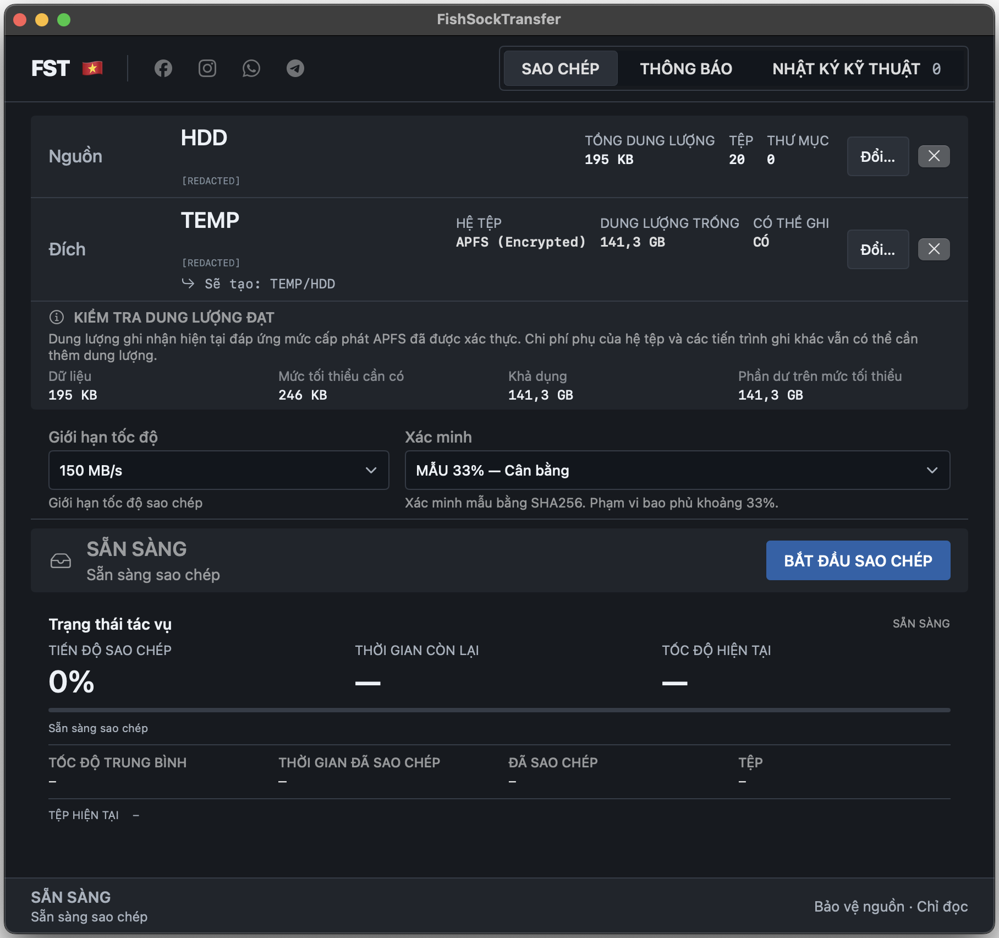
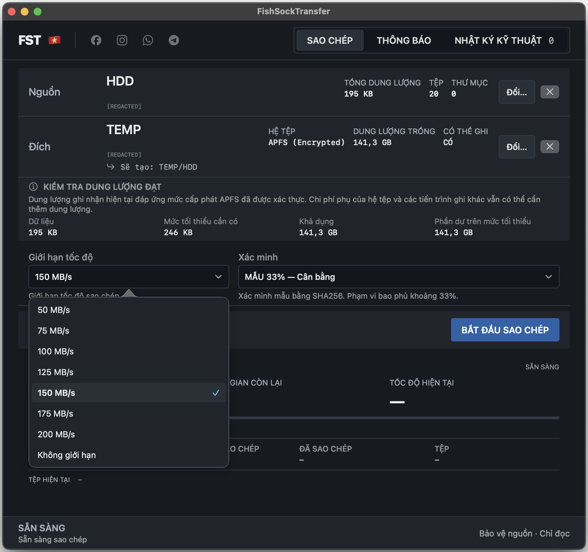
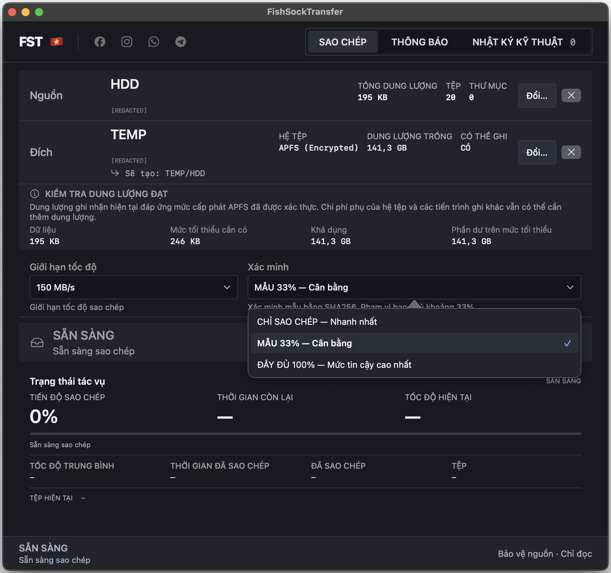
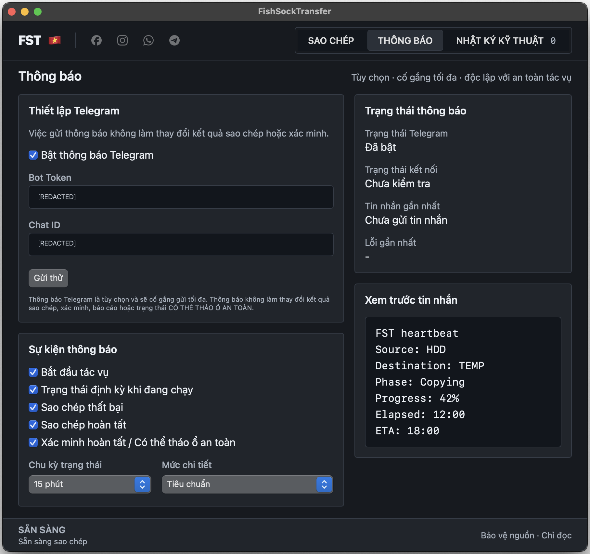
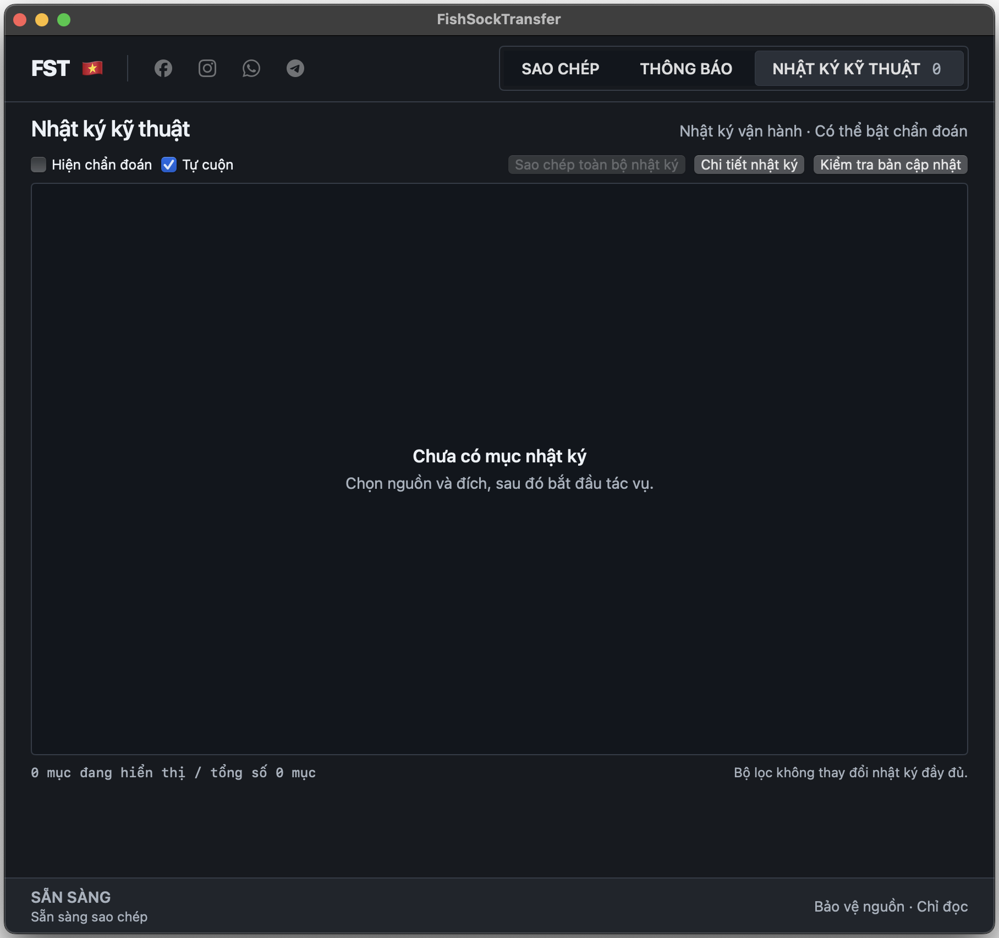

# FST / FishSockTransfer

FST là ứng dụng macOS dành cho DIT và Data Wrangler: sao chép media, xác minh dữ liệu và đọc kết quả trước khi bàn giao thiết bị nguồn.

FST is a macOS app for DITs and Data Wranglers: copy media, verify data, and review the result before handing off the source media.

**[Tải bản mới nhất / Download the latest release →](https://github.com/cenvu/FST_V2/releases/latest)**

## FST là gì? / What is FST?

FST hỗ trợ offload từ thẻ máy quay hoặc ổ lưu trữ sang một thư mục đích. Mỗi lần chạy dùng **một nguồn, một đích và một tác vụ**.

FST supports media offload from camera cards or storage drives to a destination folder. Each run uses **one source, one destination, and one active job**.

Chọn nguồn và đích → kiểm tra dung lượng đích → sao chép → xác minh theo chế độ đã chọn → đọc trạng thái cuối và báo cáo TXT. FST cung cấp bằng chứng để người vận hành quyết định bàn giao; không thay thế bản sao lưu độc lập.

Select source and destination → check destination storage → copy → verify using the selected mode → review the final status and TXT report. FST provides evidence for operator handoff decisions; independent backups are still needed.

## Giao diện / Interface

**Sao chép — sẵn sàng bắt đầu / Main Transfer — ready to start**

| Giới hạn tốc độ / Bandwidth selector | Chế độ xác minh / Verification selector |
| --- | --- |
|  |  |

| Thông báo Telegram / Telegram Notification | Nhật ký kỹ thuật / Technical Log |
| --- | --- |
|  |  |

*Ảnh giao diện hiện tại; đường dẫn cá nhân và thông tin Telegram đã được che. / Current UI screenshots; personal paths and Telegram settings have been redacted.*

## Điểm mới trong v1.4.0 / What's new in v1.4.0

- Giao diện production mới đã được phê duyệt cho Sao chép, Thông báo và Nhật ký kỹ thuật. / Approved new production UI for Transfer, Notification, and Technical Log.
- Chuyển ngôn ngữ EN/VI trong ứng dụng và ghi nhớ lựa chọn. / In-app EN/VI switching with a saved language preference.
- Bộ mức giới hạn tốc độ hiện tại, được liệt kê bên dưới. / Updated bandwidth presets, listed below.
- Hiển thị tiến độ, tốc độ hiện tại, tốc độ trung bình và thời gian còn lại (ETA) rõ hơn. / Clearer progress, current speed, average speed, and time remaining (ETA).
- Cải thiện kiểm tra dung lượng đích trước khi chạy. / Improved destination-capacity readiness checks.
- Tinh chỉnh Thông báo và Nhật ký kỹ thuật, bổ sung sao chép toàn bộ nhật ký. / Refined Notification and Technical Log presentation, including Copy All Logs.

[Xem ghi chú phát hành / Read the release notes](docs/releases/release-notes-v1.4.0.md)

## Tính năng chính / Key features

- **Nguồn và đích / Source & Destination:** chọn thư mục hoặc kéo thả. / Select folders or use drag and drop.
- **Kiểm tra lưu trữ / Storage readiness:** kiểm tra quyền ghi và dung lượng đích trước khi sao chép. / Check destination writability and capacity before copying.
- **Sao chép / Copy:** dùng rsync **3.4.4 đi kèm** và giới hạn tốc độ đã chọn. / Use **bundled rsync 3.4.4** with the selected bandwidth limit.
- **Xác minh / Verification:** None, Sample 33% hoặc Full 100%; chi tiết bên dưới. / None, Sample 33%, or Full 100%; details below.
- **Theo dõi / Monitoring:** tiến độ, tốc độ, ETA, Nhật ký kỹ thuật và báo cáo TXT. / Progress, speed, ETA, Technical Log, and a TXT report.
- **Thông báo / Notifications:** hỗ trợ Telegram tùy chọn. / Optional Telegram support. [Hướng dẫn thiết lập / Setup guide](docs/guides/telegram-bot-setup.md)

**Giới hạn tốc độ / Bandwidth presets:** 50 / 75 / 100 / 125 / 150 / 175 / 200 MB/s / Unlimited (Không giới hạn).

## Xác minh / Verification

| Chế độ / Mode | Sau khi sao chép / After copying | Khi thành công / On success |
| --- | --- | --- |
| **None / COPY ONLY** | Không xác minh hash sau sao chép. / No post-copy hash verification. | **TRANSFER COMPLETE**; không phải / never SAFE TO EJECT. |
| **SAMPLE 33% — SHA256** | Xác minh mẫu khoảng 33% số tệp. / Verify a sample of about 33% of files. | **SAFE TO EJECT**, sau khi sao chép đầy đủ và xác minh mẫu thành công. / After complete successful copy and successful sampled verification. |
| **FULL 100% — xxHash64** | Xác minh tất cả tệp bằng hash nhanh, phi mật mã. / Verify all files using a fast non-cryptographic hash. | **SAFE TO EJECT**, sau khi sao chép đầy đủ và xác minh toàn bộ thành công. / After complete successful copy and successful full verification. |

**SAFE TO EJECT chỉ xuất hiện khi sao chép đầy đủ và xác minh bắt buộc đều thành công. / SAFE TO EJECT requires complete successful copy and successful required verification.**

Sample kiểm tra một phần số tệp. Full kiểm tra mọi tệp, nhưng xxHash64 không phải hash mật mã và không bảo đảm an toàn tuyệt đối. / Sample checks a subset of files. Full checks every file, but xxHash64 is non-cryptographic and does not provide an absolute safety guarantee.

## An toàn / Safety

- **Nguồn chỉ đọc.** FST không sửa dữ liệu, format hay eject thiết bị nguồn. / **Source remains read-only.** FST does not modify source data, format, or eject source media.
- **Không ghi đè hoặc gộp âm thầm.** Nếu thư mục tác vụ đích đã tồn tại, FST chặn và yêu cầu chọn đích hoặc thư mục mới. / **No silent overwrite or merge.** An existing destination job folder blocks the transfer; choose a new destination or folder.
- **Không thành công, không SAFE TO EJECT.** Lỗi, hủy, chưa hoàn tất, trạng thái không chắc chắn hoặc None đều không cho phép trạng thái này. / **No success, no SAFE TO EJECT.** Failure, cancellation, incomplete or uncertain state, and None never authorize it.
- **Thông báo không quyết định kết quả.** Telegram chỉ hỗ trợ theo dõi; gửi thành công hay thất bại không thay đổi kết quả sao chép hoặc xác minh. / **Notifications do not determine success.** Telegram provides visibility; delivery success or failure does not change copy or verification results.

Luôn đọc trạng thái cuối và báo cáo, giữ bản sao lưu độc lập. SAFE TO EJECT không tự động cho phép xóa, format hoặc tái sử dụng nguồn. Nếu kết quả không chắc chắn, giữ nguyên nguồn và không xóa hay tái sử dụng. / Review the final status and report, and maintain independent backups. SAFE TO EJECT is not automatic approval to erase, format, or reuse the source. If the result is uncertain, preserve the source and do not erase or reuse it.

[Trách nhiệm người vận hành / Operator responsibility](docs/legal/DISCLAIMER.md)

## Cài đặt / Installation

1. Tải file **ZIP** tại [GitHub Releases — bản mới nhất / latest release](https://github.com/cenvu/FST_V2/releases/latest). / Download the **ZIP** from the latest release.
2. Giải nén, có thể chuyển ứng dụng vào Applications, rồi mở FST. / Unzip, optionally move the app to Applications, and open FST.
3. Bản hiện tại ký **ad-hoc**, chưa notarized và không ký bằng Developer ID. macOS có thể yêu cầu **Chuột phải → Open** khi mở lần đầu. / The current build is **ad-hoc signed**, not notarized, and not Developer ID signed. macOS may require **Right-click → Open** on first launch.

**Sử dụng / Use:** chọn Source và Destination, kiểm tra dung lượng, chọn tốc độ và xác minh, rồi Start. Theo dõi tiến trình và đọc kết quả cuối trước khi bàn giao. / Select Source and Destination, review storage readiness, choose bandwidth and verification, then Start. Monitor progress and review the final result before handoff.

## Phiên bản hiện tại / Current release

| Thông tin / Detail | Giá trị / Value |
| --- | --- |
| Phiên bản / Version | **1.4.0** |
| Build | **20261003** |
| Nền tảng / Platform | macOS **13.5+** |
| Kiến trúc / Architecture | **Apple Silicon arm64** |
| rsync đi kèm / Bundled rsync | **3.4.4** |
| Chữ ký / Signing | Ad-hoc; chưa notarized; không Developer ID / not notarized; not Developer ID signed |

**[Bản phát hành v1.4.0 / v1.4.0 release](https://github.com/cenvu/FST_V2/releases/tag/v1.4.0)**

## Giấy phép và ghi nhận / License & credits

Mã nguồn được công khai cho sử dụng phi thương mại; sử dụng thương mại cần có sự cho phép bằng văn bản. / Source is available for non-commercial use; commercial use requires written permission. [LICENSE](LICENSE) · [NOTICE](NOTICE)

Vũ Huy Hùng / Cen — chủ dự án / project owner. Hà Minh Quang — logo và biểu tượng ứng dụng / logo and app icon.
